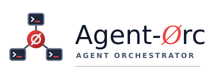
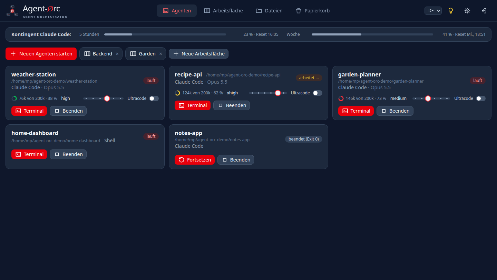
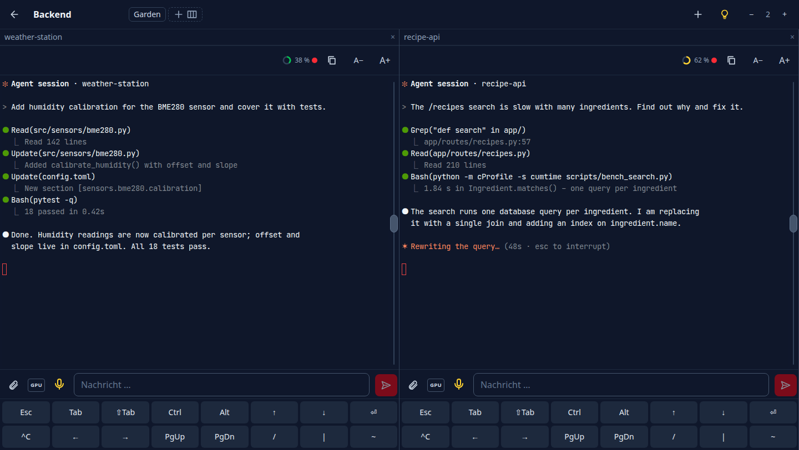
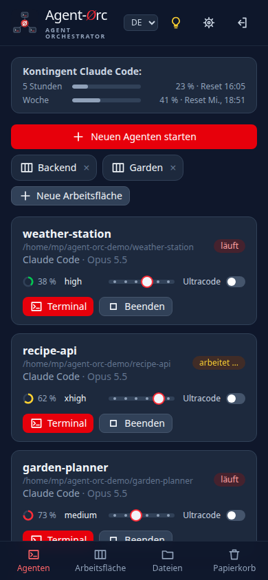
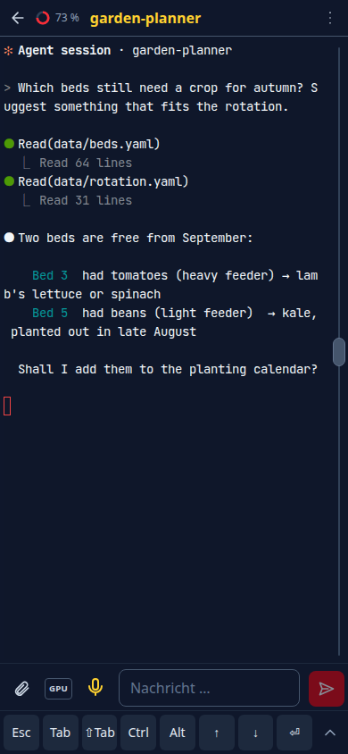

<p align="center">
  <picture>
    <source media="(prefers-color-scheme: dark)" srcset="frontend/brand/logo.svg">
    
  </picture>
</p>

[English](README.md)

> **Status: früh, aber im täglichen Einsatz.** Getestet unter Linux mit Claude Code; die
> Profile für Codex und Aider sind vorbereitet, aber ungetestet.

Agent-Orc startet, beobachtet und beendet Coding-Agenten (Claude Code, Codex, Aider, …) auf dem
eigenen Linux-Rechner, bedient über eine Web-App, die am Handy genauso funktioniert wie am
Rechner (PWA).

Jeder Agent läuft in einer eigenen `tmux`-Sitzung in einem Projektordner. Wer den Browser
schließt, trennt nur die Verbindung: Die Agenten arbeiten weiter und lassen sich von jedem Gerät
aus wieder aufnehmen.

<p align="center">
  
</p>

## Was es kann

**Agenten**
- Ordner wählen und mit einem Tipp einen Agenten starten; beenden, fortsetzen oder ein
  früheres Claude-Gespräch dieses Ordners wieder aufnehmen.
- Jede Karte zeigt das Modell des Agenten, wie voll sein Kontext ist (Ring: grün, gelb, rot ab
  70 %), ob er gerade arbeitet, und den Denkaufwand als Regler mit Ultracode-Schalter (Claude,
  pro Projektordner).
- Oben das 5-Stunden- und Wochen-Kontingent von Claude; die Karten lassen sich in die eigene
  Reihenfolge ziehen.
- Was ein Agent im Projekt geändert hat: geänderte, neue und gelöschte Dateien mit ihrem Diff
  (git).
- Token-Verbrauch aller Claude-Gespräche pro Tag, Projekt und Modell; Suche in früheren
  Gesprächen; eine Übergabe-Empfehlung, sobald der Kontext eines Agenten groß wird.
- Benachrichtigungen aufs Handy oder den Rechner, wenn ein Agent fertig ist oder auf eine
  Freigabe oder Antwort wartet (Web Push, pro Gerät einschaltbar); Antippen öffnet den Agenten.
- Der Freigabe-Modus, in dem ein Agent startet, pro Projekt (Fragen, Bearbeiten, Auto, Planen;
  Voreinstellung Auto). Fragt ein Agent um Erlaubnis, zeigt seine Karte den Befehl mit
  „Erlauben“ und „Ablehnen“; es gilt die Antwort, die zuerst kommt, auf der Karte oder im
  Terminal.
- Profile mit Modellwahl: Über ein kleines Startskript läuft Claude Code auch mit lokalen
  Modellen (z. B. vLLM oder llama-swap) oder bei anderen Anbietern. Der Startdialog bietet dann
  die Modelle und ihre Denkstufen an, mit einem Hinweis je Modell (etwa wie lange es frei
  nutzbar ist); ein Beispiel steht in den Kommentaren der Standard-Config.
- Ein Agent kann in einem eigenen Git-Worktree starten (zweite Arbeitskopie auf einem neuen
  Branch), damit zwei Agenten an einem Projekt arbeiten können; danach wird er wieder
  entfernt, ohne Arbeit zu verlieren.
- Neu starten (⟳) mit fortgesetztem Gespräch, Prompts für später planen, und nach dem
  Nutzungslimit automatisch weitermachen, sobald das Kontingent zurückgesetzt ist.
- Denselben Prompt an mehrere Agenten auf einmal schicken, abgeschickt oder nur ins Eingabefeld gelegt.
- Jede Karte hat ein Feld für die Arbeitsfläche: Ein Agent kommt in die beim Start gewählte
  Fläche und lässt sich später in eine andere verschieben; ohne Fläche steht er in „Unbenannt“.
  Hat ein Agent noch kein gespeichertes Modell, fragt Agent-Orc beim Neustart und Fortsetzen danach.
- Ein normales Terminal im Projektordner („>_“), auch neben dem laufenden Agenten.

**Arbeitsflächen**
- Mehrere Agenten als Spalten nebeneinander; Spaltenköpfe ziehen sortiert, die Trenner ziehen
  ändert die Breite.
- Arbeitsflächen liegen auf dem Server: Jedes Gerät zeigt dasselbe, und eine Änderung erscheint
  sofort überall. „Unbenannt“ steht da, solange es noch keine Fläche gibt, und das „+“ in der Leiste beginnt
  eine neue; mit einem Namen wird sie zu einer benannten, die in der Übersicht und in der Leiste jeder Arbeitsfläche erscheint. Ein Agent
  steht in genau einer Fläche: Fügt man ihn in einer anderen hinzu, wandert er. Ein Klick
  springt in den Tab, der eine Fläche zeigt – praktisch, um Arbeitsflächen auf mehrere Monitore
  zu verteilen. Am Handy wechselt die Leiste im selben Fenster.
- Einen Spaltenkopf auf den Namen einer anderen Fläche in der Leiste fallen lassen verschiebt den
  Agenten dorthin; ein Knopf neben der Spaltenzahl setzt alle verstellten Breiten zurück.
- Tastenkürzel am Rechner: Alt+Umschalt+1 … 9 für die Spalten, Alt+Umschalt+← / → für die
  Arbeitsflächen.
- Am Handy eine Spalte auf einmal: seitlich im Terminal wischen holt die nächste; ein Vollbild
  zeigt nur Terminal und Eingabefeld, die Sondertasten lassen sich einklappen, und die Aktionen
  eines Terminals liegen hinter ⋮.

<p align="center">
  
</p>

**Notizen**
- Notizbücher als Reiter, je mit losen Notizen und Ordnern; sie liegen wie die Arbeitsflächen auf dem Server.
- Eine Notiz ist Markdown mit Formatierungsleiste (fett, kursiv, Überschrift, Liste, Code, Link),
  einer Suche über Titel und Text und Text und Ansicht nebeneinander am Rechner und Tablet.
- Fotos, Screenshots und Dateien an eine Notiz hängen; sie liegen auf dem Server und werden beim
  Senden an einen Agenten in dessen Ordner kopiert. Bilder erscheinen als Vorschau, PDFs mit der
  ersten Seite (auf Wunsch alle, gezeichnet von [pdf.js](https://mozilla.github.io/pdf.js/)).
- Per Diktat (Whisper) schreiben, eine Notiz kopieren oder ins Eingabefeld eines oder mehrerer Agenten legen (auf Wunsch abgeschickt).

**Terminal**
- Ein normales Eingabefeld unter dem Terminal, damit Handytastatur, Autokorrektur und Diktat
  funktionieren; Enter sendet, Shift+Enter macht eine neue Zeile.
- Diktat über einen lokalen Whisper-Dienst ([whisper-stt](https://github.com/Peuqui/whisper-stt),
  GPU oder CPU, Engine pro Gerät wählbar, z. B. Parakeet oder Whisper) oder die
  Spracherkennung des Browsers.
- Prompt-Vorlagen für häufige Anweisungen, mit einem Tipp im Eingabefeld.
- Foto, Screenshot (aus der Galerie, am Rechner direkt vom Bildschirm oder einfach mit Strg+V
  eingefügt) oder Datei anhängen: Sie landen im Projektordner, erscheinen als kleine Vorschau
  über dem Eingabefeld und gehen mit der nächsten Nachricht an den Agenten.
- Sondertasten-Leiste (Esc, Tab, Shift+Tab, Pfeile, einrastendes Strg/Alt, …) für die
  Bildschirmtastatur, frei anpassbar und mit Text-Tasten (Makros); ein Griff zum schnellen
  Scrollen, eine Schriftgröße pro Gerät, eine Textansicht zum Markieren und Kopieren,
  anklickbare Links.

**Dateien und mehr**
- Dateien in den Projektordnern durchsuchen, bearbeiten und in den Papierkorb legen;
  Markdown als Vorschau, Bilder als Bild, andere Dateien zum Herunterladen.
- Dateipfade in der Ausgabe eines Agenten sind anklickbar und öffnen die Datei (an der
  genannten Zeile) oder den Ordner.
- Einstellungen pro Gerät (Schrift, Größe, Zeilenabstand, Scrollgeschwindigkeit) und eine Hilfe
  (Glühbirne).
- Claude-Code-Sitzungen starten mit Remote Control und erscheinen dadurch auch in der Claude-App.

<p align="center">
  
  &nbsp;&nbsp;
  
</p>

## Voraussetzungen

- Linux mit `git` und `tmux`
- Python 3.12 oder neuer
- Node.js 20.19 oder neuer mit npm (baut bei der Installation die Web-App)
- die gewünschten Agenten-CLIs, z. B. [Claude Code](https://docs.claude.com/en/docs/claude-code)
- optional, fürs Diktat: [whisper-stt](https://github.com/Peuqui/whisper-stt) (lokale
  Spracherkennung)

## Installation

```bash
git clone https://github.com/Peuqui/Agent-Orc.git && cd Agent-Orc
deploy/install.sh          # baut die Web-App, installiert nach ~/.local/share/agent-orc/venv
agent-orc setup            # stellt ein paar Fragen, schreibt Config und Passwort
agent-orc serve            # http://127.0.0.1:8770
```

`deploy/install.sh` verlinkt den Befehl `agent-orc` nach `~/.local/bin`; dieser Ordner muss im
`PATH` liegen.

`agent-orc setup` prüft, ob `tmux` und `git` da sind und welche Agenten-CLIs es findet, und
fragt dann nach:

- dem Ordner mit deinen Projekten (wird angelegt, falls es ihn nicht gibt),
- ob Agent-Orc hinter HTTPS läuft oder für einen ersten lokalen Test über einfaches HTTP,
- einem Whisper-Dienst fürs Diktat, falls du einen betreibst (es prüft, ob er antwortet); ohne
  ihn nutzt das Mikrofon die Spracherkennung des Browsers (Chrome),
- deiner E-Mail-Adresse für die Push-Dienste, die Benachrichtigungen zustellen (optional),
- dem Passwort für die Web-App.

Es schreibt `~/.config/agent-orc/config.yaml`: die mitgelieferte Standard-Config mit deinen
Antworten; ihre Kommentare erklären alle übrigen Einstellungen. `agent-orc set-password` ändert
das Passwort später.

Danach `http://127.0.0.1:8770` öffnen und mit dem Passwort anmelden.

### Aktualisieren

```bash
git pull && deploy/install.sh
```

Das Skript installiert nur committeten Code und startet einen laufenden Dienst
`agent-orc@<user>` neu; dafür braucht der Benutzer das Recht, ihn neu zu starten (z. B. per
polkit-Regel), sonst den Dienst selbst neu starten. Laufende Agenten überstehen den Neustart.

### Als Dienst

`deploy/agent-orc@.service` betreibt Agent-Orc für einen Benutzer (`agent-orc` muss in dessen
`PATH` liegen):

```bash
sudo cp deploy/agent-orc@.service /etc/systemd/system/
sudo systemctl enable --now agent-orc@$USER
```

### Hinter nginx

`deploy/nginx-location.conf` stellt Agent-Orc unter `/agent-orc/` in einem HTTPS-Serverblock
bereit, samt Terminal-WebSocket. Hinter HTTPS lässt sich die App auf dem Handy-Startbildschirm
installieren.

### Tipp: neue Agenten sofort loslegen lassen

Ein Claude-Code-Agent wartet auf die erste Nachricht. Sein Startbefehl in der Config nimmt am
Ende eine erste Anfrage an, etwa um die Schritte auszuführen, die deine Hooks verlangen:

```yaml
agents:
  claude:
    start: [claude, --settings, ..., --remote-control, "{name}",
      "Sitzungsbeginn: Führe die Pflichtschritte aus deinem Startkontext aus und melde dich dann in einem Satz bereit."]
```

Beim Fortsetzen wird sie nicht wiederholt.

## Tests

```bash
venv/bin/ruff check . && venv/bin/mypy && venv/bin/python -m pytest   # Backend, mit echtem tmux
cd frontend && npm test                                               # reine Frontend-Logik (Test-Runner von Node)
```

## Sicherheit

Agent-Orc gibt Zugriff auf den Rechner auf Shell-Ebene. Es bringt einen eigenen Login mit und
lauscht nur auf `127.0.0.1`. Ins Internet nur hinter HTTPS stellen, am besten hinter einem
Reverse Proxy mit zusätzlicher Authentifizierung.

## Lizenz

[MIT](LICENSE)
