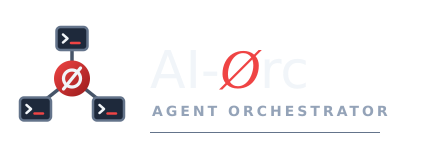

<p align="center"></p>

[Deutsch](README.de.md)

> **Status: early, but usable.** Tested on Linux with Claude Code; other agent profiles
> (Codex, Aider) are prepared but untested.

AI-Orc lets you start, watch and stop coding-agent CLI sessions
(Claude Code, Codex, Aider, …) on your own Linux machine from a
mobile-friendly web app (PWA).

Every agent runs in its own `tmux` session inside a project folder.
From your phone you can:

- create project folders and start an agent in them with one tap,
- open a terminal on any running agent, with an extra-keys bar
  (Esc, Tab, Shift+Tab, arrows, sticky Ctrl/Alt) above the on-screen keyboard,
- send text through a plain input field, so dictation and autocorrect work,
- stop and resume sessions,
- browse, edit and trash files in the project folder.

Claude Code sessions are started with Remote Control, so they also show up
in the Claude mobile app.

## Requirements

- Linux
- Python 3.12+
- `tmux`
- the agent CLIs you want to use

## Installation

AI-Orc is a Python package that ships the built web app. Until it is published, install it
from the repository:

```
git clone https://github.com/Peuqui/AI-Orc.git && cd AI-Orc
(cd frontend && npm ci && npm run build)    # build the web app first; pip packs it into the install
python3 -m venv venv && venv/bin/pip install .
venv/bin/ai-orc init            # writes ~/.config/ai-orc/config.yaml
venv/bin/ai-orc set-password    # writes ~/.config/ai-orc/credentials.json
venv/bin/ai-orc serve           # http://127.0.0.1:8770
```

Adapt `~/.config/ai-orc/config.yaml` before the first start, at least `files.base_dir`
(the folder that holds your projects). For a first test on plain HTTP, set
`server.cookie_secure: false`; behind HTTPS keep it `true`.

### As a service

`deploy/ai-orc@.service` runs AI-Orc for one user (`ai-orc` must be on that user's `PATH`):

```
sudo cp deploy/ai-orc@.service /etc/systemd/system/
sudo systemctl enable --now ai-orc@$USER
```

Restarting the service keeps running agents alive; they are picked up again.

### Behind nginx

`deploy/nginx-location.conf` serves AI-Orc under `/orc/` inside an HTTPS server block,
including the terminal WebSocket.

## Security

AI-Orc gives remote shell-level access to your machine. It ships with its
own login and listens on `127.0.0.1` only. Expose it to the internet only
behind HTTPS, ideally behind a reverse proxy with additional authentication.

## License

[MIT](LICENSE)
