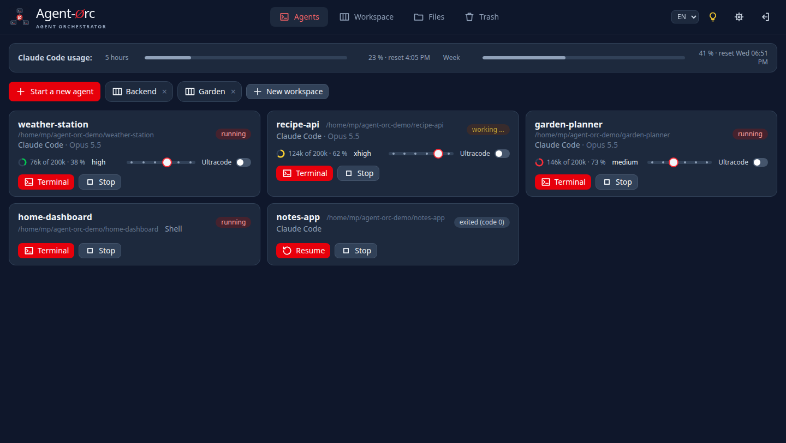
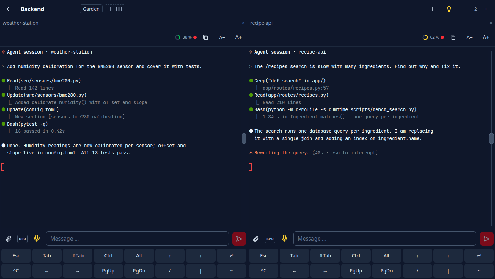
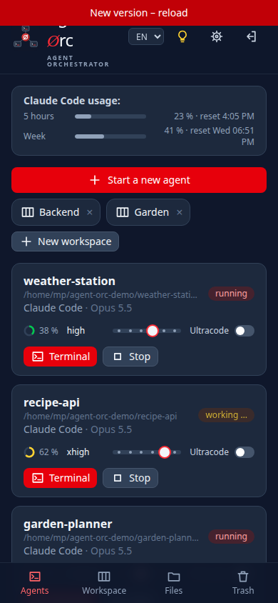
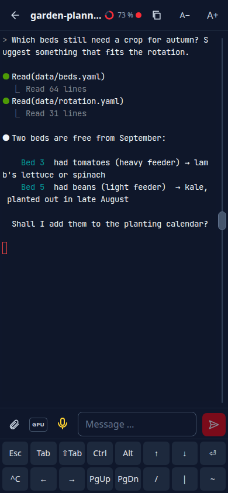

<p align="center">
  <picture>
    <source media="(prefers-color-scheme: dark)" srcset="frontend/brand/logo.svg">
    
  </picture>
</p>

[Deutsch](README.de.md)

> **Status: early, but in daily use.** Tested on Linux with Claude Code; the profiles for
> Codex and Aider are prepared but untested.

Agent-Orc starts, watches and stops coding agents (Claude Code, Codex, Aider, …) on your own
Linux machine, from a web app that works on the phone as well as on the desktop (PWA).

Every agent runs in its own `tmux` session inside a project folder. Closing the browser only
detaches: the agents keep working, and you pick them up again from any device.

<p align="center">
  
</p>

## What it does

**Agents**
- Pick a folder and start an agent with one tap; stop, resume, or resume an older Claude
  conversation of that folder.
- Every card shows the agent's model, how full its context is (ring: green, amber, red from
  70 %), whether it is working right now, and the reasoning effort as a slider with an
  ultracode switch (Claude, per project folder).
- Claude's 5-hour and weekly usage at the top; cards can be dragged into your own order.
- What an agent changed in its project: changed, new and deleted files with their diffs (git).
- Token consumption of all Claude conversations per day, project and model; search in earlier
  conversations; a handover advice once an agent's context grows large.
- Notifications on your phone or desktop when an agent is done or waits for a permission or an
  answer (Web Push, switched on per device); tapping one opens the agent.
- The permission mode an agent starts in, per project (ask, edit, auto, plan; auto by default).
- An agent can start in a git worktree of its own (a second working copy on a new branch), so
  two agents can work on one project; removed again once it has ended, without losing work.
- Restart (⟳) with the conversation resumed, schedule prompts for later, and carry on by
  itself after the usage limit once the quota is reset.
- Send the same prompt to several agents at once.
- A plain terminal in the project folder (“>_”), also next to the running agent.

**Workspaces**
- Several agents side by side as columns; drag the column heads to sort them and the dividers
  to set their width.
- Every browser tab has its own workspace. Give it a name and it is saved, shows up in the
  overview and in the bar of every workspace, and one click jumps to the tab that shows it –
  handy for spreading workspaces over several monitors. On the phone the bar switches in place.
- Shortcuts on a computer: Alt+Shift+1 … 9 for the columns, Alt+Shift+← / → for the
  workspaces.

<p align="center">
  
</p>

**Terminal**
- A plain input field below the terminal, so phone keyboards, autocorrect and dictation work;
  Enter sends, Shift+Enter starts a new line.
- Dictation through a local Whisper service ([whisper-stt](https://github.com/Peuqui/whisper-stt),
  GPU or CPU, engine chosen per device, e.g. Parakeet or Whisper) or the browser's own speech
  recognition.
- Prompt templates for frequent instructions, one tap into the input field.
- Attach a photo, a screenshot (from the gallery, captured from the screen on the desktop, or
  simply pasted with Ctrl+V) or a file: it lands in the project folder, shows as a small preview
  above the input field and goes to the agent with the next message.
- Extra-keys bar (Esc, Tab, Shift+Tab, arrows, sticky Ctrl/Alt, …) for the on-screen keyboard,
  a jog grip for fast scrolling, font size per terminal, a text view for selecting and copying,
  clickable links.

**Files and more**
- Browse, edit and trash files in your project folders; Markdown as a preview, pictures as
  pictures, other files to download.
- File paths in an agent's output are clickable and open the file (at the line named) or the
  folder.
- Settings per device (font, size, line spacing, scroll speed) and a help dialog (light bulb).
- Claude Code sessions start with Remote Control, so they also show up in the Claude app.

<p align="center">
  
  &nbsp;&nbsp;
  
</p>

## Requirements

- Linux with `git` and `tmux`
- Python 3.12 or newer
- Node.js 20.19 or newer with npm (builds the web app during installation)
- the agent CLIs you want to use, e.g. [Claude Code](https://docs.claude.com/en/docs/claude-code)
- optional, for dictation: [whisper-stt](https://github.com/Peuqui/whisper-stt) (local speech
  recognition)

## Installation

```bash
git clone https://github.com/Peuqui/Agent-Orc.git && cd Agent-Orc
deploy/install.sh          # builds the web app, installs into ~/.local/share/agent-orc/venv
agent-orc setup            # asks a few questions, writes the config and the password
agent-orc serve            # http://127.0.0.1:8770
```

`deploy/install.sh` links the `agent-orc` command into `~/.local/bin`, which must be on your
`PATH`.

`agent-orc setup` checks that `tmux` and `git` are there and which agent CLIs it finds, then
asks for:

- the folder that holds your projects (created if it does not exist),
- whether Agent-Orc runs behind HTTPS or on plain HTTP for a first local test,
- a Whisper service for dictation, if you run one (it checks that it answers); without one
  the microphone uses the browser's own speech recognition (Chrome),
- your e-mail address for the push services that deliver notifications (optional),
- the password for the web app.

It writes `~/.config/agent-orc/config.yaml`, the shipped default with your answers; its comments
explain every other setting. `agent-orc set-password` changes the password later.

Then open `http://127.0.0.1:8770` and log in with your password.

### Updating

```bash
git pull && deploy/install.sh
```

The script installs only committed code and restarts a running `agent-orc@<user>` service;
for that the user needs the right to restart it (e.g. a polkit rule), otherwise restart it
yourself. Running agents keep running across the restart.

### As a service

`deploy/agent-orc@.service` runs Agent-Orc for one user (`agent-orc` must be on that user's
`PATH`):

```bash
sudo cp deploy/agent-orc@.service /etc/systemd/system/
sudo systemctl enable --now agent-orc@$USER
```

### Behind nginx

`deploy/nginx-location.conf` serves Agent-Orc under `/agent-orc/` inside an HTTPS server block,
including the terminal WebSocket. Behind HTTPS the app can be installed on the phone's home
screen.

### Tip: let new agents get going at once

A Claude Code agent waits for your first message. Its start command in the config takes a first
request at the end, e.g. to run the steps your hooks ask for:

```yaml
agents:
  claude:
    start: [claude, --settings, ..., --remote-control, "{name}",
      "Session start: run the mandatory steps from your start context, then say in one sentence that you are ready."]
```

Resuming does not repeat it.

## Security

Agent-Orc gives shell-level access to your machine. It has its own login and listens on
`127.0.0.1` only. Expose it to the internet only behind HTTPS, ideally behind a reverse proxy
with additional authentication.

## License

[MIT](LICENSE)
